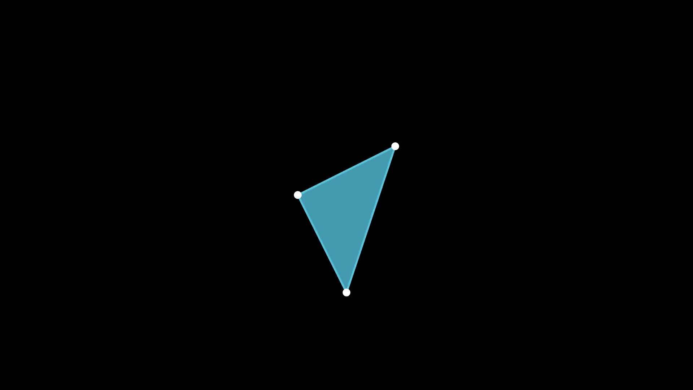

# 1.1 机械运动与质点

## 机械运动

### 机械运动的概念

**机械运动**是指物体的空间位置随时间的变化，机械运动是日常生活中最常见的运动形式。

!!! note
    在经典物理的范围，我们只研究宏观物体的低速运动，这是因为接近光速运动的物体将会出现相对论效应，微观粒子的行为需要用量子物理的知识才能解释，这些都是近代物理的学习内容。

### 机械运动的类型

- **平动**：即物体只做平移，物体各点的运动状态完全相同。若在物体上任意绘制一条直线，这条直线在运动的过程中始终与原位置平行。
- **转动**：即绕某一固定轴旋转，物体各点的运动状态与它到固定轴的距离有关。

{ width: 200px; } { width: 200px; }

若不考虑物体的形变，只考察平面运动，则一般的机械运动可分解为平动和转动的复合，物体上各点的运动状态不同，且非常复杂。

{ height="300" }
/// caption
一般平面运动
///

## 质点

### 质点的概念

描述运动的困难，还来自于物体的形状大小千差万别，有时物体的几何性质很重要，而有时就不那么重要。我们从最简单的情况开始，把物体抽象成一个点，对运动的描述最为简单。

但物理学中的点并不是单纯几何意义上的点，而是要保留它的物理属性，我们在这里保留了它的质量属性。这个点就是我们要学习的第一个物理模型：质点。

!!! tip "质点的概念"
    质点，是指有一定质量，但没有形状、大小的点。

质点是一个抽象化的物理模型，它在实际生活当中是不存在的。

### 物体视作质点的条件

物体能否视为质点，判断的根本依据在于物体的形状、大小对于要研究的问题是否有影响，忽略物体的形状、大小是否仍能较好地描述物体的运动。

具体而言，以下两种情况通常可以将物体视为质点：

- 如果物体的尺度远小于要研究的问题，则物体可以视为质点。
- 如果物体只做平动而没有转动，则物体上所有点的运动形式相同，可以任意选择一个点代表整个物体的运动。

由此可见，物体能否视为质点，并不是由物体本身的大小决定的，而是由研究的问题决定的。

!!! tip "为什么要建立物理模型"

    考虑的因素越多，模型就越能贴近现实情况，是不是模型越复杂就越好呢？其实并不是这样的，原因至少有以下几点。
    
    - 研究困难：首先考虑的因素越多，研究起来就越困难，有些问题虽然理论上有解，但是凭借人类目前的水平，根本无法对问题求解。
    - 本质不突出：模型实际上是对实际问题的抽象，这个抽象的过程就是抓主要矛盾的过程，只有我们抓住主要矛盾，忽略不重要的细节，才能明确问题的本质。
    - 过拟合：过于复杂的模型通常只针对某个具体的问题，适用性比较狭窄，而且关注过多不重要的细节，容易发生过拟合的问题，无法推广到其他的类似问题上去
    - 过度参数化：还有，模型的细节越多，参数就越多，而很多参数是我们根本没有办法准确获得的，这就是产生过分参数化的问题。如果建立了一个复杂的模型，却没有办法提供准确的参数，而模型又恰巧对这些参数又比较敏感的话，那么复杂模型的结果甚至可能还不如一个简单的模型。